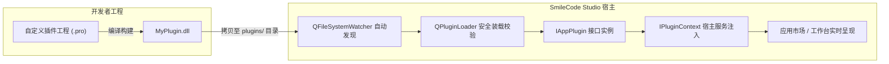

已为您整理了完整的 **Qt Plugin 动态库插件系统开发详细指南**，并在项目中创建了开箱即用的**标准化开发模板工程**。

技术文档已同步保存至：`docs/Qt_Plugin_Development_Guide.md` 模板工程位于：`Plugins/TemplatePlugin/`

------

## 插件系统架构概览

SmileCode Studio 采用了工业级可扩展的 **Qt Plugin 原生动态库机制**：



------

## 一、模板工程目录结构

在 `Plugins/TemplatePlugin/` 中提供了完整的范例文件：

```tex
Plugins/TemplatePlugin/

├── TemplatePlugin.pro          # 插件工程配置文件（自动输出并同步到 plugins 目录）

├── plugin.json                 # 嵌入式插件元数据描述文件

├── templateplugin.h            # 插件入口类头文件（实现 IAppPlugin 接口）

├── templateplugin.cpp          # 插件入口类实现（生命周期与服务交互）

├── templatewidget.h            # 插件独立 UI 界面头文件

├── templatewidget.cpp          # 插件独立 UI 界面实现（含 Toast / Log 演示）

└── README.md                   # 模板说明文档
```

------

## 二、从零开发新插件的 4 个步骤

### 第 1 步：复制模板工程并重命名

复制 `Plugins/TemplatePlugin` 文件夹，重命名为你自己的工程名称（例如 `Plugins/ModbusMasterPlugin`）。

------

### 第 2 步：配置工程文件与元数据

1. **修改 `ModbusMasterPlugin.pro`**：

   ```makefile
   
   QT += core gui widgets
   
   CONFIG += c++11 plugin
   
   TEMPLATE = lib
   TARGET = ModbusMasterPlugin
   
   # 引入核心宿主插件接口头文件目录
   
   INCLUDEPATH += $$PWD/../../PhudonTools/include
   
   HEADERS += \
   
       modbusmasterplugin.h \
   
       modbusmasterwidget.h
   
   SOURCES += \
   
       modbusmasterplugin.cpp \
   
       modbusmasterwidget.cpp
   
   DISTFILES += plugin.json
   
   # 默认生成在当前工程根目录下
   
   DESTDIR = $$PWD
   
   # 编译完成后自动复制到宿主主程序 plugins 目录
   
   DEST_PLUGIN_DIR = $$PWD/../../PhudonTools/plugins
   
   QMAKE_POST_LINK += $$QMAKE_COPY $$shell_path($$DESTDIR/$${TARGET}.dll) $$shell_path($$DEST_PLUGIN_DIR)
   ```

2. **配置 `plugin.json`**：

   ```json
   {
   
       "id": "modbus_master",
   
       "name": "Modbus 主站调试器",
   
       "version": "1.0.0",
   
       "author": "SmileCode Team",
   
       "category": "总线与通信"
   
   }
   ```

------

### 第 3 步：实现插件接口与界面

1. **入口类实现 `IAppPlugin`**：

   ```cpp
   
   #include <QObject>
   
   #include "iappplugin.h"
   
   #include "modbusmasterwidget.h"
   
   
   
   class ModbusMasterPlugin : public QObject, public IAppPlugin {
   
       Q_OBJECT
   
       Q_PLUGIN_METADATA(IID IAppPlugin_IID FILE "plugin.json")
   
       Q_INTERFACES(IAppPlugin)
   
   
   
   public:
   
       QString id() const override { return "modbus_master"; }
   
       QString name() const override { return QStringLiteral("Modbus 主站调试器"); }
   
       QString subtitle() const override { return QStringLiteral("RTU / TCP 寄存器批量读写与解析"); }
   
       QString version() const override { return "v1.0.0"; }
   
       QString author() const override { return "SmileCode Team"; }
   
       QString category() const override { return QStringLiteral("总线与通信"); }
   
       QString description() const override { return QStringLiteral("支持标准 01/02/03/04/05/06/15/16 功能码读写..."); }
   
       QStringList tags() const override { return {"Modbus", "RTU", "TCP", "寄存器"}; }
   
       QString iconUnicode() const override { return "0xe8a2"; }  // 矢量图标字体编码
   
       QString colorHex() const override { return "#FF6D00"; }   // 主题强调色
   
   
   
       bool initialize(IPluginContext *context) override {
   
           m_context = context;
   
           if (m_context) {
   
               m_context->log("INFO", "ModbusMasterPlugin 插件加载成功。");
   
           }
   
           return true;
   
       }
   
       void shutdown() override {
   
           m_context = nullptr;
   
       }
   
       QWidget* createWidget(QWidget *parent = nullptr) override {
   
           auto *widget = new ModbusMasterWidget(m_context, parent);
   
           if (m_context) {
   
               widget->applyTheme(m_context->currentTheme());
   
           }
   
           return widget;
   
       }
   
   
   
       void applyTheme(const QString &themeId) override {
   
           if (m_currentWidget) {
   
               m_currentWidget->applyTheme(themeId);
   
           }
   
       }
   
   
   
   private:
   
       IPluginContext *m_context = nullptr;
   
       QPointer<ModbusMasterWidget> m_currentWidget;
   
   };
   ```

2. **在界面中调用宿主核心能力 `IPluginContext`**：

   ```cpp
   // 1. 弹出悬浮 Toast 通知
   
   m_context->showToast(QStringLiteral("读取线圈寄存器成功！"), "success", 2500);
   
   // 2. 写入全局系统日志
   
   m_context->log("INFO", "Modbus RTU 通信建立: COM1 @ 9600");
   
   // 3. 获取当前主题
   
   QString currentTheme = m_context->currentTheme();
   ```

------

### 第 4 步：编译与即插即用测试

进入插件目录并运行编译：

```powershell
cd m:\TOPFIRE\SmileCodeIDEUpdate\Plugins\ModbusMasterPlugin

qmake ModbusMasterPlugin.pro

mingw32-make
```

- 编译完成后会在本地生成 `ModbusMasterPlugin.dll`，并自动分发至 `PhudonTools/plugins/` 目录。
- **无需重启主程序**：主程序的目录监控引擎会自动检测到新 DLL，瞬间加载并在应用市场/工作台上线展示。