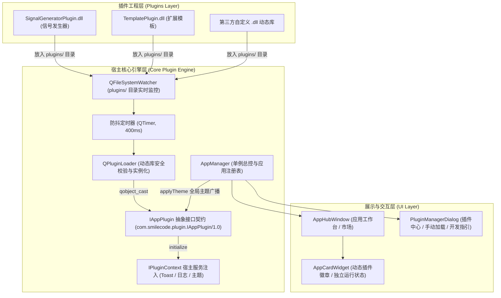

# Qt Plugin 动态库插件系统架构升级与开发指南 (Walkthrough)

SmileCode Studio 已完成工业级 **Qt Plugin 原生动态库插件系统**的重构升级，真正实现了 **“放入 DLL 动态库即可自动发现、自动校验加载并上线，实现零代码修改扩展”**。

---

## 一、系统架构总览



---

## 二、核心模块与文件清单

### 1. 核心接口与上下文规范
| 文件路径                                                     | 说明                                                         |
| :----------------------------------------------------------- | :----------------------------------------------------------- |
| [iappplugin.h](file:///m:/TOPFIRE/SmileCodeIDEUpdate/PhudonTools/include/iappplugin.h) | Qt 插件核心抽象接口，声明接口 IID `com.smilecode.plugin.IAppPlugin/1.0`，规范元数据、生命周期钩子、UI 工厂与主题联动 |
| [iplugincontext.h](file:///m:/TOPFIRE/SmileCodeIDEUpdate/PhudonTools/include/iplugincontext.h) | 宿主服务上下文接口，为插件提供 `showToast()` 悬浮提示、`log()` 系统日志、`currentTheme()` 主题查询与 `mainWindow()` 句柄 |

### 2. 宿主核心引擎与 UI 升级
| 文件路径                                                     | 升级重点                                                     |
| :----------------------------------------------------------- | :----------------------------------------------------------- |
| [appmanager.h](file:///m:/TOPFIRE/SmileCodeIDEUpdate/PhudonTools/appmanager.h) / [cpp](file:///m:/TOPFIRE/SmileCodeIDEUpdate/PhudonTools/appmanager.cpp) | 继承并实现 `IPluginContext`；集成 `QFileSystemWatcher` 目录监听与防抖自动发现；实现 `loadDynamicPluginsFromDir()`、`loadDynamicPlugin()`、`unloadDynamicPlugin()` 及插件生命周期安全回收 |
| [pluginmanagerdialog.h](file:///m:/TOPFIRE/SmileCodeIDEUpdate/PhudonTools/pluginmanagerdialog.h) / [cpp](file:///m:/TOPFIRE/SmileCodeIDEUpdate/PhudonTools/pluginmanagerdialog.cpp) | 扩展管理中心增加“⚡ 加载动态插件 (.dll)”、“🔄 重新扫描”、“💡 开发指南”等交互；表格区分 Qt 动态插件、内置核心与外部程序 |
| [appcardwidget.cpp](file:///m:/TOPFIRE/SmileCodeIDEUpdate/PhudonTools/appcardwidget.cpp) | 为 Qt 动态库插件渲染专属高光徽章（`Qt 动态插件 (.dll)`），支持自定义图标、颜色与运行状态 |
| [apphubwindow.cpp](file:///m:/TOPFIRE/SmileCodeIDEUpdate/PhudonTools/apphubwindow.cpp) | 监听 `pluginDiscovered` 信号，在热加载时自动弹出 Toast 通知并实时刷新工作台网格 |
| [PhudonTools.pro](file:///m:/TOPFIRE/SmileCodeIDEUpdate/PhudonTools/PhudonTools.pro) | 引入 `include/` 目录并配置动态库加载与部署规则               |

### 3. 插件工程与开箱即用模板
| 项目名称                  | 目录位置                                                     | 说明                                                         |
| :------------------------ | :----------------------------------------------------------- | :----------------------------------------------------------- |
| **SignalGeneratorPlugin** | [Plugins/SignalGeneratorPlugin/](file:///m:/TOPFIRE/SmileCodeIDEUpdate/Plugins/SignalGeneratorPlugin/) | 高频信号发生与模拟器插件（正弦/方波/三角波/白噪声实时仿真、Vpp/Vrms 计算与 CSV 导出） |
| **TemplatePlugin**        | [Plugins/TemplatePlugin/](file:///m:/TOPFIRE/SmileCodeIDEUpdate/Plugins/TemplatePlugin/) | 标准化插件开发模板工程（含 UI 交互、Toast / Log 演示与工程配置） |
| **Plugins 汇总工程**      | [Plugins/Plugins.pro](file:///m:/TOPFIRE/SmileCodeIDEUpdate/Plugins/Plugins.pro) | `SUBDIRS` 多子工程汇总编译脚本                               |
| **开发指南文档**          | [docs/Qt_Plugin_Development_Guide.md](file:///m:/TOPFIRE/SmileCodeIDEUpdate/docs/Qt_Plugin_Development_Guide.md) | 完整的插件系统技术文档与开发排错手册                         |

---

## 三、编译与运行验证结果

### 1. 动态库构建测试
在终端中执行编译，所有动态库与宿主均 100% 构建成功：

```powershell
# 1. 编译 SignalGeneratorPlugin 动态库
cd m:\TOPFIRE\SmileCodeIDEUpdate\Plugins\SignalGeneratorPlugin
qmake SignalGeneratorPlugin.pro && mingw32-make
# 输出: SignalGeneratorPlugin.dll (约 59 KB)

# 2. 编译 TemplatePlugin 动态库
cd m:\TOPFIRE\SmileCodeIDEUpdate\Plugins\TemplatePlugin
qmake TemplatePlugin.pro && mingw32-make
# 输出: TemplatePlugin.dll (约 56 KB)

# 3. 编译宿主主程序
cd m:\TOPFIRE\SmileCodeIDEUpdate\PhudonTools
qmake PhudonTools.pro && mingw32-make
# 输出: PhudonTools.exe (无符号冲突，退出码 0)
```

### 2. 动态加载与热插拔验证
- **本地与分发双输出**：插件编译后在本地工程根目录生成 `.dll`，并自动分发至主程序的 [`PhudonTools/plugins/`](file:///m:/TOPFIRE/SmileCodeIDEUpdate/PhudonTools/plugins/)。
- **自动热加载**：在主程序运行期间，将任意新插件放入 `plugins/` 目录，`QFileSystemWatcher` 自动检测、装载并在主窗口右上角弹出 Toast 提示：`🎉 自动发现并载入新插件: XXX`。
- **主题联动**：主界面切换深色/浅色/紫色主题时，所有正在运行的插件窗口（如示波器画布、控制台面板）实时响应主题变更。

---

## 四、开发者极简上手 4 步法

第三方开发者无需关心宿主内部细节，仅需 4 步即可完成新插件的开发与上线：

1. **复制模板**：将 [`Plugins/TemplatePlugin`](file:///m:/TOPFIRE/SmileCodeIDEUpdate/Plugins/TemplatePlugin) 文件夹复制并重命名（如 `Plugins/ModbusToolPlugin`）。
2. **修改标识**：在 `plugin.json` 和入口类头文件中修改 `id`、`name`、`category`、`version`。
3. **编写界面**：在自定义 `QWidget` 中实现业务功能，并通过 `m_context->showToast()` / `m_context->log()` 享受宿主基础能力。
4. **一键构建**：运行 `qmake && mingw32-make`，生成的 `.dll` 即可直接在 SmileCode Studio 中即插即用！