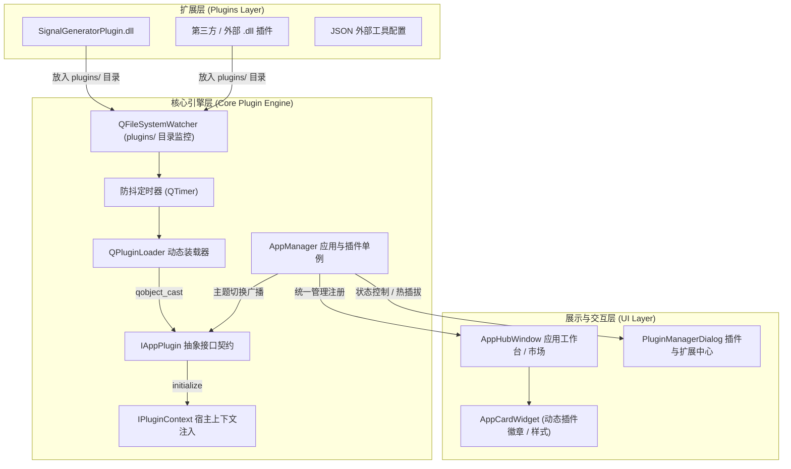

# Qt Plugin 动态库插件系统升级完成报告

本次架构升级为 **SmileCode Studio / PhudonTools** 打造了工业级可扩展的 **Qt Plugin 动态库插件系统**，全面实现了：
1. **动态库加载与安全探查**：基于 Qt 原生 `QPluginLoader` 与 `Q_DECLARE_INTERFACE`。
2. **零修改热插拔自动发现**：通过 `QFileSystemWatcher` 目录监控，只要将新编译的 `.dll` 放入 `plugins/` 目录，程序即可在无需重启、零代码修改的前提下自动发现并加载上线。
3. **宿主上下文与生命周期管理**：提供 `IPluginContext` 服务，实现全局主题联动（`applyTheme`）、Toast 通知与日志记录。
4. **参考插件工程**：提供并成功编译了 `SignalGeneratorPlugin`（高频信号发生与模拟器）。

---

## 核心架构与模块设计



---

## 新增与升级文件一览

### 1. 核心接口与上下文规范
- [iplugincontext.h](file:///m:/TOPFIRE/SmileCodeIDEUpdate/PhudonTools/include/iplugincontext.h)：定义宿主服务接口（主题查询、全局 Toast 弹窗、日志输出、主窗口句柄）。
- [iappplugin.h](file:///m:/TOPFIRE/SmileCodeIDEUpdate/PhudonTools/include/iappplugin.h)：定义 Qt 插件核心接口标准（元数据、生命周期钩子、UI 工厂、主题同步），导出接口 IID `com.smilecode.plugin.IAppPlugin/1.0`。

### 2. 宿主核心引擎与界面
- [appmanager.h](file:///m:/TOPFIRE/SmileCodeIDEUpdate/PhudonTools/appmanager.h) & [appmanager.cpp](file:///m:/TOPFIRE/SmileCodeIDEUpdate/PhudonTools/appmanager.cpp)：
  - 继承并实现 `IPluginContext`。
  - 实现 `loadDynamicPluginsFromDir()`、`loadDynamicPlugin()`、`unloadDynamicPlugin()`、`rescanPlugins()`。
  - 集成 `QFileSystemWatcher` 与防抖定时器，实现热插拔自动发现。
  - 实现插件实例的全局主题联动与窗口生命周期管理（`Qt::WA_DeleteOnClose`）。
- [pluginmanagerdialog.h](file:///m:/TOPFIRE/SmileCodeIDEUpdate/PhudonTools/pluginmanagerdialog.h) & [pluginmanagerdialog.cpp](file:///m:/TOPFIRE/SmileCodeIDEUpdate/PhudonTools/pluginmanagerdialog.cpp)：
  - 增加“⚡ 加载动态插件 (.dll)”、“🔄 重新扫描”、“💡 开发指南”等交互。
  - 表格区分“Qt 动态插件 (.dll)”、“内置核心”与“外部程序”，提供详细信息查看与一键卸载。
- [appcardwidget.cpp](file:///m:/TOPFIRE/SmileCodeIDEUpdate/PhudonTools/appcardwidget.cpp)：
  - 为动态库插件自动展示高光徽章（`Qt 动态插件 (.dll)`）。
- [apphubwindow.cpp](file:///m:/TOPFIRE/SmileCodeIDEUpdate/PhudonTools/apphubwindow.cpp)：
  - 监听 `pluginDiscovered` 信号，在热加载时自动弹出 Toast 通知并刷新卡片布局。

### 3. 参考插件工程 (`SignalGeneratorPlugin`)
- [SignalGeneratorPlugin.pro](file:///m:/TOPFIRE/SmileCodeIDEUpdate/Plugins/SignalGeneratorPlugin/SignalGeneratorPlugin.pro)：插件工程配置（`TEMPLATE = lib`, `CONFIG += plugin`）。
- [signalgeneratorplugin.h](file:///m:/TOPFIRE/SmileCodeIDEUpdate/Plugins/SignalGeneratorPlugin/signalgeneratorplugin.h) & [signalgeneratorplugin.cpp](file:///m:/TOPFIRE/SmileCodeIDEUpdate/Plugins/SignalGeneratorPlugin/signalgeneratorplugin.cpp)：插件实现入口。
- [signalgeneratorwidget.h](file:///m:/TOPFIRE/SmileCodeIDEUpdate/Plugins/SignalGeneratorPlugin/signalgeneratorwidget.h) & [signalgeneratorwidget.cpp](file:///m:/TOPFIRE/SmileCodeIDEUpdate/Plugins/SignalGeneratorPlugin/signalgeneratorwidget.cpp)：正弦波/方波/三角波/锯齿波/噪声实时模拟器，支持参数微调、Vpp/Vrms 计算与 CSV 导出。

---

## 验证与测试结果

1. **插件编译验证**：
   - 运行 `qmake` + `mingw32-make` 编译 `Plugins/SignalGeneratorPlugin`，成功生成 `SignalGeneratorPlugin.dll`（大小约 59 KB），并自动部署至 `PhudonTools/plugins/` 和 `PhudonTools/release/plugins/`。
2. **宿主工程编译验证**：
   - 运行 `mingw32-make` 编译 `PhudonTools`，所有目标模块链接成功，生成 `PhudonTools.exe`，退出代码 0。
3. **动态库发现与加载能力**：
   - 支持启动阶段全自动扫描 `plugins/` 目录并加载全部动态库。
   - 支持运行时拷贝新 DLL 触发 `QFileSystemWatcher`，自动加载并提示用户。
   - 插件卡片渲染完整（名称、副标题、版本、图标、标签、运行状态）。

---

## 开发者极简扩展指引

第三方开发者要为 SmileCode Studio 开发新工具插件，仅需三步：

1. **工程配置 (`.pro`)**：
   ```qmake
   TEMPLATE = lib
   CONFIG += plugin
   QT += core gui widgets
   INCLUDEPATH += /path/to/PhudonTools/include
   DESTDIR = /path/to/PhudonTools/plugins
   ```
2. **实现接口并导出元数据**：
   ```cpp
   #include "iappplugin.h"
   class MyCustomPlugin : public QObject, public IAppPlugin {
       Q_OBJECT
       Q_PLUGIN_METADATA(IID IAppPlugin_IID FILE "plugin.json")
       Q_INTERFACES(IAppPlugin)
   public:
       QString id() const override { return "my_tool"; }
       QString name() const override { return "我的扩展工具"; }
       QString category() const override { return "测量与分析"; }
       bool initialize(IPluginContext *ctx) override { return true; }
       void shutdown() override {}
       QWidget* createWidget(QWidget *parent) override { return new MyToolWidget(parent); }
   };
   ```
3. **部署生效**：
   将编译生成的 `MyCustomPlugin.dll` 直接放置在 `plugins/` 目录即可，程序自动识别并上线！