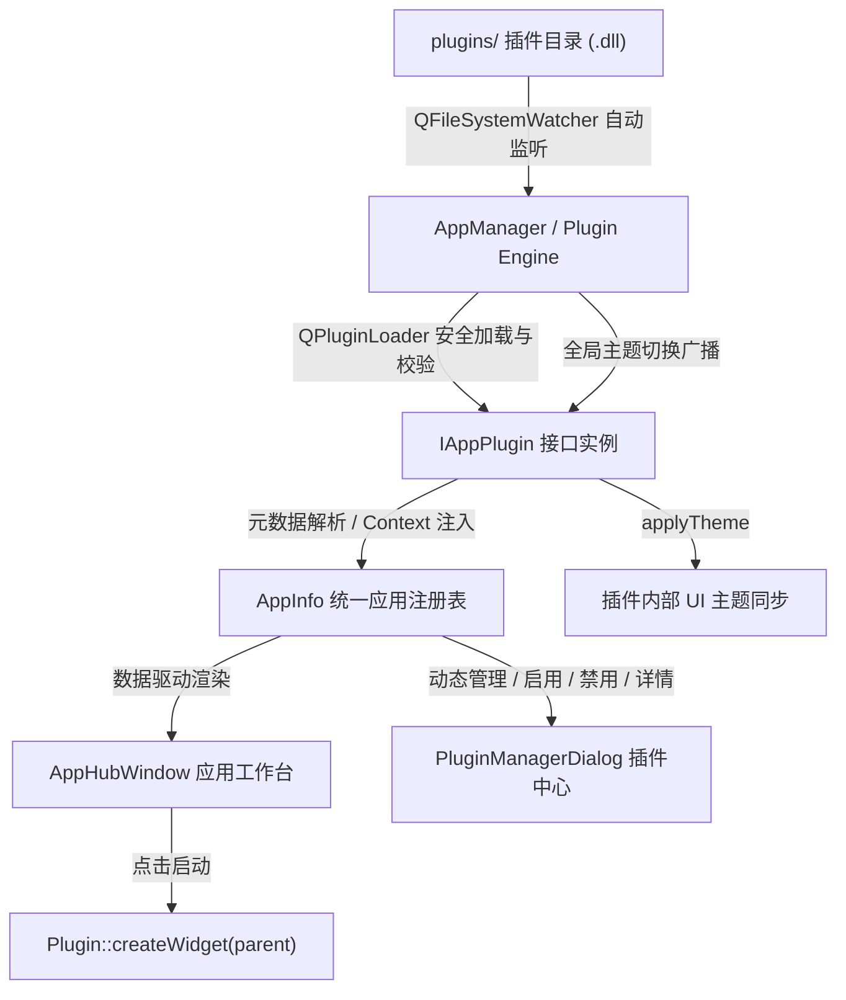

# Qt Plugin 动态库插件系统架构升级方案

打造工业级可扩展的 Qt 插件架构，实现动态链接库（DLL/SO）的自动发现、校验、生命周期管理与热插拔加载。无需修改宿主程序源码，开发者只需将编译好的动态库 DLL 放入 `plugins/` 目录，程序即可自动识别并在应用市场/工作台中呈现。

---

## 架构设计核心规范

### 1. 插件契约接口 (`IAppPlugin` & `IPluginContext`)
- **`IAppPlugin`**：定义统一的 Qt 插件接口标准，导出 IID `com.smilecode.plugin.IAppPlugin/1.0`。
  - 元数据提供：`id()`、`name()`、`subtitle()`、`version()`、`author()`、`category()`、`description()`、`tags()`、`iconUnicode()`、`colorHex()`。
  - 生命周期管理：`initialize(IPluginContext *context)`、`shutdown()`。
  - 界面工厂：`createWidget(QWidget *parent)`。
  - 主题自适应：`applyTheme(const QString &themeId)`。
- **`IPluginContext`**：宿主服务上下文，提供主题查询、全局通知 (Toast)、日志记录等服务，实现宿主与插件解耦。

### 2. 动态加载与目录热监听引擎 (`AppManager`)
- **动态库扫描与加载**：
  - 支持扫描 `plugins/` 及子目录下的 `.dll` (Windows) / `.so` (Linux) / `.dylib` (macOS)。
  - 利用 `QPluginLoader` 提取嵌入的 `Q_PLUGIN_METADATA` 元数据与类实例。
  - 通过 `qobject_cast<IAppPlugin*>` 验证插件接口兼容性与版本有效性。
- **热插拔与自动发现 (Auto-Discovery)**：
  - 使用 `QFileSystemWatcher` 对 `plugins/` 目录进行实时监控。
  - 当用户在运行中将新的 DLL 放入 `plugins/` 目录时，防抖定时器自动触发增量扫描，零重启热加载新插件并刷新 UI。
  - 当 DLL 被移除时，安全关闭相关实例并从列表卸载。

### 3. UI 界面与交互体验升级
- **`AppCardWidget`**：
  - 为动态库插件展示专属高光徽章（`Qt 动态插件`）。
  - 自动渲染插件自定义的矢量图标（Font Icon）、分类、版本及标签。
- **`PluginManagerDialog`**：
  - 增加“Qt 动态插件 (.dll)”类型支持与专属状态展示。
  - 提供“📂 打开插件目录”、“🔄 重新扫描”、“➕ 手动选择 DLL 加载”、“查看详情”等交互。
  - 提供“💡 插件开发模板与指南”，方便第三方开发者快速开发新插件。
- **`AppHubWindow`**：
  - 监听插件注册事件，实时刷新主界面卡片与分类统计。

### 4. 示例插件工程 (`SignalGeneratorPlugin`)
- 创建独立的子工程 `Plugins/SignalGeneratorPlugin`（信号发生器与波形模拟工具插件）。
- 实现完整的 `IAppPlugin` 接口、内置 JSON 元数据、独立 UI 界面与主题切换支持。
- 配置 `SignalGeneratorPlugin.pro` 输出到 `plugins/` 目录进行自动化编译与验证。

---

## 拟修改与新增文件清单

### [核心接口与上下文]
- [NEW] [iappplugin.h](file:///m:/TOPFIRE/SmileCodeIDEUpdate/PhudonTools/include/iappplugin.h) - 插件抽象接口标准与元数据规范
- [NEW] [iplugincontext.h](file:///m:/TOPFIRE/SmileCodeIDEUpdate/PhudonTools/include/iplugincontext.h) - 宿主上下文服务接口

### [宿主程序优化]
- [MODIFY] [appmanager.h](file:///m:/TOPFIRE/SmileCodeIDEUpdate/PhudonTools/appmanager.h) - 增加动态库加载器管理、文件系统监听器、IPluginContext 实现与动态插件生命周期管理
- [MODIFY] [appmanager.cpp](file:///m:/TOPFIRE/SmileCodeIDEUpdate/PhudonTools/appmanager.cpp) - 实现 `loadDynamicPluginsFromDir`、`loadDynamicPlugin(dllPath)`、`setupDirectoryWatcher` 及热插拔逻辑
- [MODIFY] [pluginmanagerdialog.h](file:///m:/TOPFIRE/SmileCodeIDEUpdate/PhudonTools/pluginmanagerdialog.h) - 增加加载 DLL、扫描目录槽函数与详情展示
- [MODIFY] [pluginmanagerdialog.cpp](file:///m:/TOPFIRE/SmileCodeIDEUpdate/PhudonTools/pluginmanagerdialog.cpp) - 升级插件表格显示、手动加载 DLL、扫描刷新及开发指南弹窗
- [MODIFY] [appcardwidget.cpp](file:///m:/TOPFIRE/SmileCodeIDEUpdate/PhudonTools/appcardwidget.cpp) - 动态插件徽章与类型样式优化
- [MODIFY] [PhudonTools.pro](file:///m:/TOPFIRE/SmileCodeIDEUpdate/PhudonTools/PhudonTools.pro) - 添加 include 包含路径与动态库支持

### [参考插件工程]
- [NEW] [Plugins/SignalGeneratorPlugin/SignalGeneratorPlugin.pro](file:///m:/TOPFIRE/SmileCodeIDEUpdate/Plugins/SignalGeneratorPlugin/SignalGeneratorPlugin.pro) - 插件工程配置
- [NEW] [Plugins/SignalGeneratorPlugin/plugin.json](file:///m:/TOPFIRE/SmileCodeIDEUpdate/Plugins/SignalGeneratorPlugin/plugin.json) - 插件元数据配置
- [NEW] [Plugins/SignalGeneratorPlugin/signalgeneratorplugin.h](file:///m:/TOPFIRE/SmileCodeIDEUpdate/Plugins/SignalGeneratorPlugin/signalgeneratorplugin.h) - 插件入口定义
- [NEW] [Plugins/SignalGeneratorPlugin/signalgeneratorplugin.cpp](file:///m:/TOPFIRE/SmileCodeIDEUpdate/Plugins/SignalGeneratorPlugin/signalgeneratorplugin.cpp) - 插件入口实现
- [NEW] [Plugins/SignalGeneratorPlugin/signalgeneratorwidget.h](file:///m:/TOPFIRE/SmileCodeIDEUpdate/Plugins/SignalGeneratorPlugin/signalgeneratorwidget.h) - 插件界面定义
- [NEW] [Plugins/SignalGeneratorPlugin/signalgeneratorwidget.cpp](file:///m:/TOPFIRE/SmileCodeIDEUpdate/Plugins/SignalGeneratorPlugin/signalgeneratorwidget.cpp) - 插件界面实现

---

## 验证计划

### 1. 编译与构建验证
- 使用 `qmake` + `mingw32-make` 编译 `SignalGeneratorPlugin.pro`，生成 `SignalGeneratorPlugin.dll`。
- 使用 `qmake` + `mingw32-make` 编译 `PhudonTools.pro`，确保无报错、无符号冲突。

### 2. 功能与热插拔测试
- **静态发现**：在程序启动前将 `SignalGeneratorPlugin.dll` 放置在 `plugins/` 目录，启动程序验证自动加载与注册。
- **动态热加载**：在程序运行状态下，将新的 `.dll` 复制到 `plugins/` 目录，验证 `QFileSystemWatcher` 自动检测并刷新主界面。
- **界面与功能交互**：在 AppHubWindow 点击卡片启动插件界面，测试信号波形生成、参数调节、关闭与多实例隔离。
- **主题自适应**：切换全局主题（深色/浅色/紫色等），验证插件内控件主题是否实时同步。
- **插件管理**：在插件管理中心中测试启用/禁用、查看 DLL 路径、重新扫描等功能。