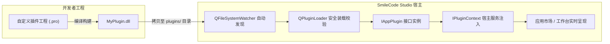

# SmileCode Qt Plugin 动态库插件系统开发指南

---

## 1. 架构总览

SmileCode Studio 采用了工业级可扩展的 **Qt Plugin 原生动态库插件系统**，支持热插拔与自动发现：



### 核心特性：
- **零修改扩展**：开发者无需修改宿主程序任何源码，只需将生成的 `.dll`（或 Linux 下的 `.so`）拷贝到 `plugins/` 目录。
- **热插拔与自动发现**：主程序内置 `QFileSystemWatcher` 目录监控，在运行状态下新增、更新或删除 DLL 会自动实时触发热扫描，无需重启软件。
- **主题自适应**：宿主切换主题时，自动调用插件的 `applyTheme(themeId)` 进行全局主题同步。
- **双向通信解耦**：宿主向插件注入 `IPluginContext` 服务上下文，插件可调用全局 Toast 通知、日志记录器等。

---

## 2. 插件项目标准目录结构

推荐将所有新插件项目建立在 `Plugins/` 目录下，结构如下：

```text
Plugins/
├── Plugins.pro                     # 汇总工程 (SUBDIRS)
├── TemplatePlugin/                 # 开箱即用开发模板工程
│   ├── TemplatePlugin.pro          # Qt 工程描述文件
│   ├── plugin.json                 # 插件元数据描述文件
│   ├── templateplugin.h            # 插件入口类头文件 (实现 IAppPlugin)
│   ├── templateplugin.cpp          # 插件入口类实现
│   ├── templatewidget.h            # 插件 UI 界面头文件
│   ├── templatewidget.cpp          # 插件 UI 界面实现
│   └── README.md                   # 模板说明文档
└── SignalGeneratorPlugin/          # 信号发生器插件参考实现
    ├── SignalGeneratorPlugin.pro
    ├── plugin.json
    ├── signalgeneratorplugin.h
    ├── signalgeneratorplugin.cpp
    ├── signalgeneratorwidget.h
    └── signalgeneratorwidget.cpp
```

---

## 3. 核心契约接口详解

所有插件必须实现 [`iappplugin.h`](file:///m:/TOPFIRE/SmileCodeIDEUpdate/PhudonTools/include/iappplugin.h) 中定义的抽象接口。

### 3.1 插件接口 `IAppPlugin`
```cpp
#include "iappplugin.h"

class MyPlugin : public QObject, public IAppPlugin {
    Q_OBJECT
    // 1. 声明插件元数据与接口 IID
    Q_PLUGIN_METADATA(IID IAppPlugin_IID FILE "plugin.json")
    Q_INTERFACES(IAppPlugin)

public:
    // 2. 核心元数据 (必须实现)
    QString id() const override { return "my_plugin_id"; }              // 唯一 ID (英文下划线)
    QString name() const override { return "我的串口分析器"; }          // 显示名称
    QString subtitle() const override { return "支持高速抓包与过滤"; }  // 副标题
    QString version() const override { return "v1.0.0"; }               // 版本号
    QString author() const override { return "开发者/团队名称"; }        // 作者
    QString category() const override { return "总线与通信"; }          // 分类名称
    QString description() const override { return "详细功能介绍..."; }  // 介绍
    QStringList tags() const override { return {"串口", "分析", "抓包"}; } // 标签

    // 3. 图标与主题强调色 (可选)
    QString iconUnicode() const override { return "0xe661"; }          // 矢量图标字体编码
    QString colorHex() const override { return "#0984e3"; }            // 主题强调色 (Hex)

    // 4. 生命周期管理
    bool initialize(IPluginContext *context) override;                  // 插件初始化 (注入上下文)
    void shutdown() override;                                          // 插件析构释放

    // 5. 界面工厂与主题
    QWidget* createWidget(QWidget *parent = nullptr) override;         // 创建 UI 实例
    void applyTheme(const QString &themeId) override;                  // 主题同步通知
};
```

### 3.2 宿主上下文接口 `IPluginContext`
宿主在调用 `initialize(context)` 时将自身上下文传入，插件可利用其调用宿主系统能力：
```cpp
// 1. 弹出悬浮 Toast 通知 (type 可选 "info", "success", "warning", "error")
context->showToast("数据保存成功！", "success", 2500);

// 2. 写入全局系统日志
context->log("INFO", "插件串口连接已建立: COM3 @ 115200");

// 3. 获取当前主题 ID ("dark", "light", "purple" 等)
QString currentTheme = context->currentTheme();

// 4. 获取宿主主窗口指针
QWidget* mainWin = context->mainWindow();
```

---

## 4. 插件元数据 `plugin.json`
在工程根目录下放置 `plugin.json`（该文件会被 `Q_PLUGIN_METADATA` 编译并嵌入到 DLL 资源段中）：
```json
{
    "id": "my_plugin_id",
    "name": "我的串口分析器",
    "version": "1.0.0",
    "author": "SmileCode Team",
    "category": "总线与通信"
}
```

---

## 5. 工程文件 `.pro` 标准配置

```qmake
QT += core gui widgets

# 1. 关键：声明为插件动态库
CONFIG += c++11 plugin
TEMPLATE = lib

# 2. 目标名称 (生成 MyPlugin.dll)
TARGET = MyPlugin

# 3. 引入宿主核心头文件目录
INCLUDEPATH += $$PWD/../../PhudonTools/include

# 4. 源文件与头文件
HEADERS += \
    myplugin.h \
    mywidget.h

SOURCES += \
    myplugin.cpp \
    mywidget.cpp

DISTFILES += \
    plugin.json

# 5. 生成在当前工程根目录
DESTDIR = $$PWD

# 6. 编译完成后自动拷贝至宿主主程序的 plugins 目录
DEST_PLUGIN_DIR = $$PWD/../../PhudonTools/plugins
QMAKE_POST_LINK += $$QMAKE_COPY $$shell_path($$DESTDIR/$${TARGET}.dll) $$shell_path($$DEST_PLUGIN_DIR)
```

---

## 6. 从零开发新插件实战步骤

### 步骤一：复制模板工程
直接复制 [`Plugins/TemplatePlugin`](file:///m:/TOPFIRE/SmileCodeIDEUpdate/Plugins/TemplatePlugin) 文件夹并重命名为你自己的项目（例如 `Plugins/ModbusToolPlugin`）。

### 步骤二：修改标识与元数据
1. 修改 `ModbusToolPlugin.pro` 中的 `TARGET = ModbusToolPlugin`。
2. 修改 `plugin.json` 中的 `id` 与 `name`。
3. 在入口类中实现 `id()`、`name()`、`category()` 等元数据。

### 步骤三：编写界面与业务代码
在自定义的 `QWidget`（如 `ModbusToolWidget`）中编写业务逻辑。

### 步骤四：编译与部署
在插件目录下打开终端：
```powershell
cd m:\TOPFIRE\SmileCodeIDEUpdate\Plugins\ModbusToolPlugin
qmake ModbusToolPlugin.pro
mingw32-make
```

### 步骤五：验证与测试
1. 检查当前目录下已生成 `ModbusToolPlugin.dll`。
2. 检查 `PhudonTools/plugins/` 目录下已自动同步存在该文件。
3. 运行 `PhudonTools.exe`，在应用市场/工作台中即可点击打开并体验新插件！

---

## 7. 常见问题与排错指南

| 现象 | 可能原因 | 解决办法 |
| :--- | :--- | :--- |
| **DLL 生成后宿主未加载** | 接口 IID 不匹配或未声明 `Q_INTERFACES(IAppPlugin)` | 确保声明了 `Q_INTERFACES(IAppPlugin)`，且 IID 为 `com.smilecode.plugin.IAppPlugin/1.0`。 |
| **主程序报 “无法实例化”** | 插件与宿主使用的 Qt 版本或编译器不一致 | 确保插件使用与宿主完全相同的编译器（如 `MinGW 8.1 64-bit / Qt 5.15.2`）进行编译。 |
| **关闭窗口后内存未释放** | 未设置关闭销毁属性 | 宿主已默认设置 `Qt::WA_DeleteOnClose`，插件内若有异步线程需在 `QWidget::closeEvent` 或 `IAppPlugin::shutdown` 中显式停止。 |
| **复制插件时提示文件占用** | 插件窗口正在运行被操作系统锁定 | 先在主程序中关闭该插件窗口，或在插件管理中心中卸载后再覆盖 DLL。 |

