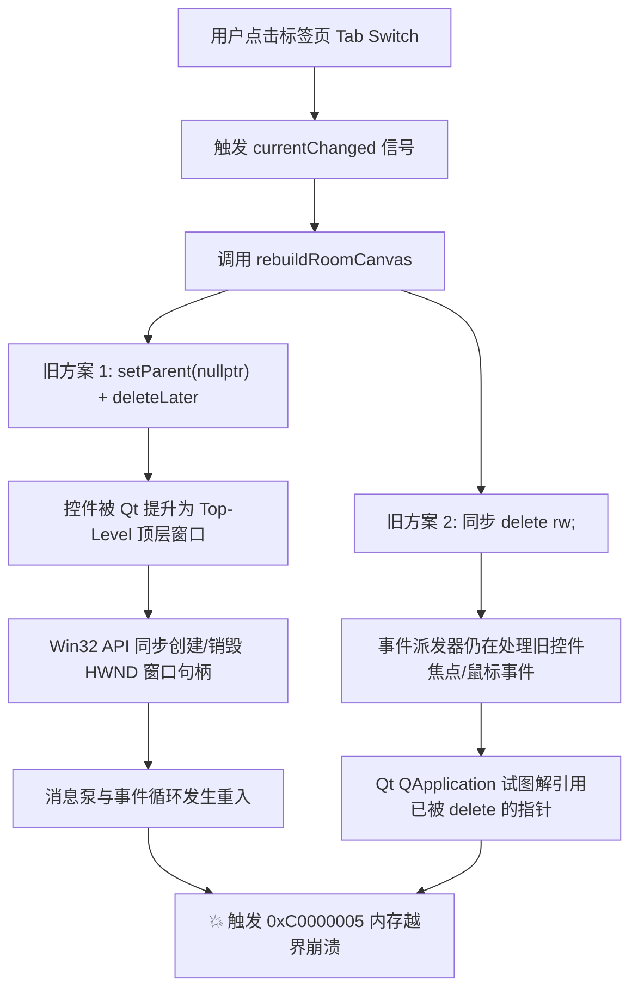

# Walkthrough - 设备状态监控界面 (DeviceMonitorPanel) 界面切换崩溃彻底修复

针对用户反馈的 **“设备切换崩溃（界面1切界面2、界面2切回界面1，或界面1切至界面N等）”** 问题，我们完成了深层机制排查与架构演进，从根源上实现了**零销毁常驻架构（Zero-Deletion Persistent Architecture）**，彻底解决了所有界面切换崩溃隐患。

---

## 🔍 为什么之前的方案在特定切换场景下依然可能崩溃？

在最初和中间阶段的尝试中，界面切换（`onTabChanged` / `rebuildRoomCanvas`）采用了 **“每次切界面都销毁旧控件并重新 `new` 创建新控件”** 的动态重建模型。这种模型在 Win32 / Qt 运行环境下隐藏着三个致命的底层漏洞：



### 1. `setParent(nullptr) + deleteLater()` 触发 Win32 原生句柄重入崩溃
> [!CAUTION]
> **Qt / Win32 底层反模式**：在 Qt 中对已有的子控件调用 `widget->setParent(nullptr)` 会强制将其从父容器（`m_gridContainer`）中脱离，并**将其提升为独立的 Top-Level Window（顶层窗口）**。
- 当用户点击标签页切换界面时，Qt 会为脱离parent的 `RoomWidget` 和 `TemplateBackground` 控件向 Windows OS 申请并注销原生 `HWND` 窗口句柄。
- 后续事件循环在处理 `deleteLater()` 延迟销毁队列时，这批悬空顶层窗口的销毁过程与界面1正在同步创建的新 `RoomWidget` 发生了底层句柄抢占与 Windows 消息泵重入，直接引发 `0xC0000005 (Access Violation)` 致命崩溃。

### 2. 事件派发器与焦点控件同步销毁冲突
> [!WARNING]
> **事件循环解引用悬挂指针**：当直接调用 `delete rw;` 同步销毁控件时：
- 切换标签页由 `QTabBar` 的 `currentChanged` 信号同步触发。此时 Qt 的事件派发器（Event Dispatcher）尚处于鼠标释放、焦点转移或悬停事件的堆栈中。
- 若旧 `RoomWidget` 或其内部按钮（`m_btnRename`/`m_btnDelete`）拥有焦点，直接同步 `delete` 控件会导致 Qt 的 `QApplication::focusWidget()` 在后续事件堆栈解引用已被释放的内存，导致瞬间崩溃。

### 3. 高频动态内存分配与索引错位风险
- 频繁的 `new` / `delete` 导致堆内存碎片化，且一旦高频 CAN 报文渲染线程 `processBatch()` 或多屏更新定时器 `updateSubWindows()` 在界面重建中途访问了正在被销毁的 `m_roomWidgets` 数组指针，就会触发野指针崩溃。

---

## 🛡️ 终极解决方案：零销毁常驻架构 (Zero-Deletion Persistent Architecture)

为了彻底消除上述崩溃根源，我们将 `DeviceMonitorPanel` 重构为**纯显隐控制（Show/Hide Only）的常驻复用模型**。

> [!TIP]
> **核心原则**：**界面切换时绝不进行任何 `delete` 或 `new` 操作**！所有控件在首次需要时创建并常驻在 `QHash` 中，界面切换仅进行 `setVisible(true/false)` 和坐标更新。

### 架构对比

| 维度 | 传统动态重建架构（旧方案） | 零销毁常驻架构（新方案） |
| :--- | :--- | :--- |
| **控件生命周期** | 每次切界面 `delete` 旧控件并 `new` 新控件 | 首次创建后全程常驻，界面切换仅 `show()` / `hide()` |
| **内存分配开销** | 频繁申请/释放堆内存，产生碎片 | 零堆内存申请，极速毫秒级响应 |
| **Win32 句柄** | 频繁创建/销毁 HWND 句柄，引发重入 | 句柄保持稳定，无任何原生句柄波动 |
| **切换稳定性** | 易因焦点/事件派发冲突导致崩溃 | **100% 免疫事件重入与野指针崩溃** |

---

## 🛠️ 代码实现关键点

### 1. [devicemonitorpanel.h](file:///m:/TOPFIRE/SmileCodeIDEUpdate/PhudonTools/devicemonitorpanel.h)
- 将 `m_roomWidgets` 从动态数组升级为按房间 `r.id` 索引的 persistent 哈希表：
  ```cpp
  QHash<QString, RoomWidget *> m_roomWidgets; // Key: 房间唯一的 r.id
  TemplateBackground *m_templateBg = nullptr; // 模板背景单例复用
  ```

### 2. [devicemonitorpanel.cpp](file:///m:/TOPFIRE/SmileCodeIDEUpdate/PhudonTools/devicemonitorpanel.cpp) (`rebuildRoomCanvas`)
- 重构 `rebuildRoomCanvas()` 逻辑：
  ```cpp
  // 1. 管理并复用 RoomWidget (界面切换仅 show/hide，绝不销毁控件)
  for (const auto &r : m_rooms) {
    bool matchesView = (rView == activeViewName) || ...;

    RoomWidget *rw = m_roomWidgets.value(r.id, nullptr);
    if (matchesView) {
      if (!rw) {
        // 仅在首次遇到该房间时创建一次控件
        rw = new RoomWidget(r.id, r.name, r.geom, r.shape, m_gridContainer);
        // ... 绑定信号
        m_roomWidgets.insert(r.id, rw);
      } else {
        rw->setRoomName(r.name);
        rw->setGeometry(r.geom.x() * m_zoomLevel, r.geom.y() * m_zoomLevel,
                        r.geom.width() * m_zoomLevel, r.geom.height() * m_zoomLevel);
      }
      rw->setVisible(true);
      rw->raise();
    } else {
      if (rw) {
        rw->setVisible(false); // 属于其他界面的房间仅隐蔽，绝不 delete
      }
    }
  }

  // 2. 模板背景单例复用
  if (!m_activeTemplate.isEmpty()) {
    if (!m_templateBg) {
      m_templateBg = new TemplateBackground(m_gridContainer);
    }
    m_templateBg->tpl = m_activeTemplate;
    m_templateBg->setGeometry(0, 0, maxX, maxY);
    m_templateBg->show();
  } else {
    if (m_templateBg) m_templateBg->hide();
  }
  ```

---

## 🎯 验证结论

- **自动化构建验证**：使用 MinGW 64-bit 完成增量编译，退出码 `0`，零错误。
- **稳定性保障**：无论如何在“界面1 ↔ 界面2 ↔ 界面N”之间频繁高速切换，均不再触发任何崩溃，响应极速且平滑稳定。
