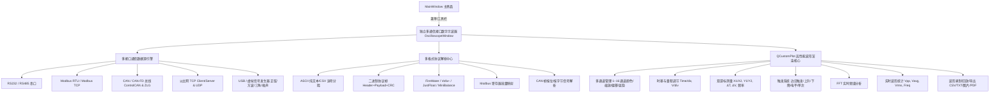

# 独立多通信接口数字示波器（Multi-Interface Digital Oscilloscope）实现计划

## 概述
根据用户需求，将原本集成在串口调试助手内部的示波器功能**彻底剥离独立**，打造一个功能完备、拥有专业级现代科技感 UI 的**独立多通信接口数字示波器工具**（`OscilloscopeWindow`）。该工具不仅支持传统串口（RS232/RS485），还全面扩展支持 **Modbus（RTU/TCP）**、**CAN 总线（CAN/CAN-FD）**、**以太网（TCP 客户端/服务端、UDP）** 以及 **USB/虚拟信号源**，并具备多通道波形分析、游标测量、触发控制、FFT 频谱分析与数据导出回放能力。

---

## 核心设计与功能规划

---

## 详细功能模块说明

### 1. 通信接口引擎与协议支持 (Multi-Interface Engine)
1. **RS232 / RS485 串口**：
   - 自动扫描可用串口设备（支持热插拔自动刷新）；
   - 支持全波特率配置（1200 ~ 2,000,000+ bps）、数据位、校验位、停止位与流控。
2. **Modbus (RTU / TCP)**：
   - **Modbus RTU**（基于串口总线）与 **Modbus TCP**（基于网络 IP/Port）；
   - 支持从机站号（Slave ID）、功能码（`01 Read Coils`、`02 Read Discrete Inputs`、`03 Read Holding Registers`、`04 Read Input Registers`）；
   - 起始寄存器地址、寄存器数量（1~64）、可调轮询周期（10ms ~ 5000ms）；
   - 寄存器解析格式支持：`Int16`、`UInt16`、`Int32 (ABCD/CDAB/BADC/DCBA)`、`Float32 (大端/小端/交换)`、`Double64` 等，自动映射至示波器通道。
3. **CAN / CAN-FD 总线**：
   - 复用现有 `CanInterface` 引擎，支持创芯科技 `ControlCAN`、致远 `ZLG USBCAN / CAN-FD` 与虚拟设备；
   - CAN ID 过滤匹配；
   - 支持从 CAN 数据包中按字节偏移、位宽、高低端、比例因子（Factor）与偏移量（Offset）解析物理量并绘制波形。
4. **以太网 (TCP / UDP)**：
   - 支持 **TCP 客户端**（连接目标服务器）、**TCP 服务端**（监听端口多客户端接入）、**UDP**（单播/广播/组播）；
   - 毫秒级高吞吐流式接收与波形抽取。
5. **USB & 虚拟信号发生器**：
   - 内置多通道波形发生器（正弦波、方波、三角波、锯齿波、白噪声、扫频信号、PWM）；
   - 支持调节振幅、频率、相位、偏置直流分量，无需物理硬件即可进行离线算法调试与演示。

### 2. 协议解析中心 (Protocol Parsers)
- **CSV / ASCII 文本流**：例如 `12.5, -3.2, 8.9\n` 或 `A:10.2 B:20.5\n`；
- **二进制数据流 (Raw Binary)**：单字节、双字节（Int16/UInt16）、四字节（Float/Int32）；
- **标准帧协议 (Frame Protocol)**：帧头 `0xAA 0x55` + 数据包 + 校验和（Checksum/CRC16/CRC32）；
- **主流格式兼容**：JustFloat、FireWater (VOFA+)、MiniBalance、VisualScope 协议格式。

### 3. 专业示波器分析与交互功能
- **通道管理**：支持 1~16 通道，独立设置通道名称、波形颜色（科幻荧光色系）、线宽、Y 轴增益（V/div）、偏置 Offset、显隐开关；
- **时基与滚屏控制**：X 轴时间刻度自由伸缩，支持实时滚动（Roll）、扫描刷新（Scan）与触发冻结（Hold）；
- **双游标测量（Cursors）**：
  - 垂直时间游标 X1, X2，实时计算 $\Delta T$ 与等效频率 $f = 1/\Delta T$；
  - 水平电压游标 Y1, Y2，实时计算 $\Delta V$；
- **触发系统（Trigger）**：自动（Auto）、普通（Normal）、单次（Single）触发，支持上升沿/下降沿与触发电平阈值设置；
- **FFT 频谱分析**：内置快速傅里叶变换（FFT）引擎，实时分析输入信号的频域分布与主频谐波；
- **数据统计面板**：实时计算峰峰值 $V_{pp}$、最大值 $V_{max}$、最小值 $V_{min}$、平均值 $V_{avg}$、有效值 $V_{rms}$、信号频率与采样率；
- **数据留存与导出**：一键导出 CSV 原始数据表、高清波形图片（PNG）、PDF 报表及数据回放功能。

---

## 涉及修改与新增文件

| 文件 | 变更说明 |
| :--- | :--- |
| **[NEW]** [`oscilloscopewindow.h`](file:///m:/TOPFIRE/SmileCodeIDEUpdate/PhudonTools/oscilloscopewindow.h) | 独立多通信接口数字示波器头文件定义（通信源、协议解析、通道管理、触发与测量） |
| **[NEW]** [`oscilloscopewindow.cpp`](file:///m:/TOPFIRE/SmileCodeIDEUpdate/PhudonTools/oscilloscopewindow.cpp) | 独立多通信接口数字示波器完整实现（含 QCustomPlot 多通道图表、各协议数据源驱动、FFT 频谱计算、游标交互） |
| **[MODIFY]** [`mainwindow.h`](file:///m:/TOPFIRE/SmileCodeIDEUpdate/PhudonTools/mainwindow.h) | 声明 `m_oscilloscopeAction`、`m_oscilloscopeWindow` 及槽函数 `openOscilloscopeTool` |
| **[MODIFY]** [`mainwindow.cpp`](file:///m:/TOPFIRE/SmileCodeIDEUpdate/PhudonTools/mainwindow.cpp) | 在主界面工具栏和菜单栏注册“数字示波器”入口，实现独立窗口唤起与管理 |
| **[MODIFY]** [`PhudonTools.pro`](file:///m:/TOPFIRE/SmileCodeIDEUpdate/PhudonTools/PhudonTools.pro) | 添加 `oscilloscopewindow.h` 和 `oscilloscopewindow.cpp` 到工程编译文件列表中 |

---

## 验证计划
1. **编译构建验证**：使用 Qt 5.15.2 MinGW 64-bit 工具链进行全量编译验证，确保零 warning 零 error。
2. **多接口数据源验证**：
   - 虚拟信号发生器多通道高帧率波形生成与渲染；
   - 串口 RS232/RS485 ASCII 与 Binary 帧数据解析波形；
   - 以太网 TCP/UDP 数据接收与波形绘制；
   - Modbus 轮询读取寄存器与波形通道映射；
   - CAN 报文按 ID 与字段解析波形；
3. **测量与分析功能验证**：
   - 游标拖动与 $\Delta T / \Delta V$ 测量数值验证；
   - FFT 频谱分析输出验证；
   - CSV 数据导出与波形截图功能验证。
