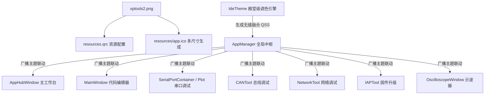

# 软件图标更换与全套 APP 主题渐变一体化重构方案

## 方案概述 (Overview)
本项目针对用户提出的两大核心诉求进行全面重构与优化：
1. **全套软件图标更新为 `xptools2.png`**：包含全局应用程序图标、窗口标题栏图标、系统托盘图标、各独立子工具（IDE、串口助手、CAN助手、网络助手、IAP工具、示波器）的窗口图标，以及 Windows 原生 EXE 执行档多分辨率 `.ico` 文件替换。
2. **全套 APP 与主界面主题一致性与渐变无缝融合**：
   - 彻底解决各子窗口、主界面工作台以及不同区域出现硬编码颜色、突兀色块、死角白块或渐变断层的问题；
   - 建立 **双向实时同步的全局主题分发中枢**，任何窗口（主工作台下拉框、IDE 菜单、串口工具栏主题菜单、CAN 工具栏主题菜单、示波器主题等）切换主题时，所有正在运行的窗口和新打开的窗口均即时无缝联动切换；
   - **重构串口调试助手（SerialPortPlot）**：重点重构打开串口、关闭串口与刷新串口的操作区域，去除过小的 38x38 字符小图标及过时的拟物开关图片，升级为高辨识度、现代感十足的渐变交互大按钮与内嵌式 LED 状态胶囊徽标。

---

## 拟修改文件与架构设计 (Proposed Changes)

---

### 一、软件图标升级 (App Icon Update)

#### [MODIFY] [resources.qrc](file:///m:/TOPFIRE/SmileCodeIDEUpdate/PhudonTools/resources.qrc)
- 添加 `icons/xptools2.png` 资源路径声明。

#### [MODIFY] [main.cpp](file:///m:/TOPFIRE/SmileCodeIDEUpdate/PhudonTools/main.cpp)
- 将 `app.setWindowIcon(...)` 更新为 `":/icons/xptools2.png"`。

#### [MODIFY] [apphubwindow.cpp](file:///m:/TOPFIRE/SmileCodeIDEUpdate/PhudonTools/apphubwindow.cpp)
- 窗口图标、系统托盘图标、顶栏 Brand Logo 全部统一为 `":/icons/xptools2.png"`。

#### [MODIFY] [mainwindow.cpp](file:///m:/TOPFIRE/SmileCodeIDEUpdate/PhudonTools/mainwindow.cpp)
- 窗口图标与“关于”对话框图标更新为 `":/icons/xptools2.png"`。

#### [MODIFY] [serialportplot.cpp](file:///m:/TOPFIRE/SmileCodeIDEUpdate/PhudonTools/serialportplot.cpp), [cantool.cpp](file:///m:/TOPFIRE/SmileCodeIDEUpdate/PhudonTools/cantool.cpp), [networktool.cpp](file:///m:/TOPFIRE/SmileCodeIDEUpdate/PhudonTools/networktool.cpp), [iaptool.cpp](file:///m:/TOPFIRE/SmileCodeIDEUpdate/PhudonTools/iaptool.cpp), [oscilloscopewindow.cpp](file:///m:/TOPFIRE/SmileCodeIDEUpdate/PhudonTools/oscilloscopewindow.cpp)
- 统一所有子工具主窗口的 `setWindowIcon` 为 `":/icons/xptools2.png"`。

#### [MODIFY] [resources/app.ico & logo.ico](file:///m:/TOPFIRE/SmileCodeIDEUpdate/PhudonTools/resources/app.ico)
- 基于 `icons/xptools2.png` 生成包含 16x16, 32x32, 48x48, 64x64, 128x128, 256x256 的 Windows 原生可执行文件图标，替换现有 `app.ico` 与 `logo.ico`。

---

### 二、主题引擎与全局渐变统一 (Theme System & Gradient Unification)

#### [MODIFY] [idetheme.h](file:///m:/TOPFIRE/SmileCodeIDEUpdate/PhudonTools/idetheme.h)
- **扩充全局样式选择器**：
  - 覆盖所有窗口根容器：`#appHubRoot`, `#hubCentral`, `#networkToolRoot`, `#iapToolRoot`, `#oscilloscopeRoot`, `#serialRoot`, `#canRoot`, `#serialContainer` 等；
  - 确保窗口背景（`{{WINDOW_BG_GRAD}}`）、卡片（`{{CARD_BG}}`）、头部（`{{HEADER_BG}}`）、侧边栏（`{{SIDEBAR_BG}}`）、状态栏（`{{STATUSBAR_BG}}`）具有细腻平滑的现代渐变过渡；
  - 彻底消除各类容器的分裂异色、突兀白边、原生灰块、滚动条死角；
  - 为串口控制区、网络控制区、IAP 进度条、示波器面板制定专属的全局融合规则。

#### [MODIFY] [appmanager.h](file:///m:/TOPFIRE/SmileCodeIDEUpdate/PhudonTools/appmanager.h) & [appmanager.cpp](file:///m:/TOPFIRE/SmileCodeIDEUpdate/PhudonTools/appmanager.cpp)
- **升级全局主题中枢**：
  - 在 `applyThemeToWidget(QWidget *widget)` 中，增加对所有子工具（`MainWindow`, `SerialPortContainer`, `SerialPortPlot`, `CANTool`, `NetworkTool`, `IAPTool`, `OscilloscopeWindow`, `AppHubWindow`）的类型识别与动态主题应用；
  - 在 `setCurrentTheme(const QString &themeId)` 中，除了更新 `qApp` 样式表外，主动遍历所有打开的窗口并同步更新它们的主题状态；
  - 保存主题持久化配置到注册表/配置文件。

#### [MODIFY] [apphubwindow.h](file:///m:/TOPFIRE/SmileCodeIDEUpdate/PhudonTools/apphubwindow.h) & [apphubwindow.cpp](file:///m:/TOPFIRE/SmileCodeIDEUpdate/PhudonTools/apphubwindow.cpp)
- 增加 `applyTheme(const QString &themeId)` 接口；
- 移除此前硬编码的 `rgba(30, 39, 46, ...)` / `rgba(24, 28, 34, ...)` 等颜色，改为通过 `IdeTheme::ThemePalette` 动态计算渐变色与边框色；
- 顶栏、分类侧边栏、推荐 Hero 渐变横幅、中央滚动区域、卡片列表以及底部状态栏，均随主题切换呈现完美融合的视觉效果；
- 保持主题下拉选择器与 `AppManager` 状态完全双向绑定。

#### [MODIFY] [appcardwidget.h](file:///m:/TOPFIRE/SmileCodeIDEUpdate/PhudonTools/appcardwidget.h) & [appcardwidget.cpp](file:///m:/TOPFIRE/SmileCodeIDEUpdate/PhudonTools/appcardwidget.cpp)
- 支持 `applyTheme(const IdeTheme::ThemePalette &pal)`；
- 应用卡片的背景、边框、阴影、悬停渐变以及高亮流光效果，根据当前主题的 `cardBg`、`borderLight`、`accentHover` 动态渲染。

---

### 三、串口调试助手（SerialPortPlot）深度优化

#### [MODIFY] [serialportplot.h](file:///m:/TOPFIRE/SmileCodeIDEUpdate/PhudonTools/serialportplot.h) & [serialportplot.cpp](file:///m:/TOPFIRE/SmileCodeIDEUpdate/PhudonTools/serialportplot.cpp)
1. **重构打开串口 / 刷新串口区域（消除小图标与老旧切图）**：
   - **打开/关闭串口主控按钮 (`m_btnOpenClose`)**：
     - 从原先 38x38 的单一字符小按钮重构为 **高辨识度渐变交互按钮**（包含清晰大图标与文字，例如 `⚡ 打开串口` / `🛑 关闭串口`）；
     - 状态平滑过渡：未连接时呈现翡翠绿宝石渐变（Emerald Gradient）与呼吸悬停效果；连接后平滑转为深红珊瑚渐变（Crimson Gradient），按压/悬停反馈明显；
     - 尺寸适中舒展，排版整洁。
   - **刷新串口端口按钮 (`m_btnRefresh`)**：
     - 升级为独立清晰的刷新动作按钮，带有显眼的 `🔄 刷新` 图标与文本，尺寸协调（高度 34px+），与波特率选择行或控制行完美对齐。
   - **状态指示徽标 (`m_lblStatusBadge`)**：
     - 彻底废弃旧版 `OFF5.png` / `ON2.png` 拟物图片；
     - 替换为 **现代化内嵌发光状态徽标（Status Pill/Badge）**：
       - 关闭状态：显示 `⚪ 未连接`，采用柔和暗色胶囊边框；
       - 打开状态：显示 `🟢 COMx · 115200 8-N-1`，带有动态发光绿点与柔和背景。
2. **清理串口调试助手的局部异色**：
   - 将帧格式提示、浮动工具条、分屏控制、收发区域、波形图背景等所有样式，全面统一到 `IdeTheme::generateStyleSheet` 与调色板中；
   - 工具栏右侧的“主题切换”菜单在选择主题时，调用 `AppManager::instance()->setCurrentTheme(...)` 实现全局双向联动。

---

### 四、其他工具（CAN、网络、IAP、示波器）主题与融合完善

#### [MODIFY] [networktool.h](file:///m:/TOPFIRE/SmileCodeIDEUpdate/PhudonTools/networktool.h) & [networktool.cpp](file:///m:/TOPFIRE/SmileCodeIDEUpdate/PhudonTools/networktool.cpp)
- 设定对象名为 `networkToolRoot`；
- 实现 `applyTheme(const QString &themeId)`，使其参数分组框、网络通信控制按钮、数据收发视图以及状态栏与全局主题一致。

#### [MODIFY] [iaptool.h](file:///m:/TOPFIRE/SmileCodeIDEUpdate/PhudonTools/iaptool.h) & [iaptool.cpp](file:///m:/TOPFIRE/SmileCodeIDEUpdate/PhudonTools/iaptool.cpp)
- 设定对象名为 `iapToolRoot`；
- 实现 `applyTheme(const QString &themeId)`，确保协议切换、烧录进度条、文件选择器及日志输出窗口色彩融合。

#### [MODIFY] [oscilloscopewindow.h](file:///m:/TOPFIRE/SmileCodeIDEUpdate/PhudonTools/oscilloscopewindow.h) & [oscilloscopewindow.cpp](file:///m:/TOPFIRE/SmileCodeIDEUpdate/PhudonTools/oscilloscopewindow.cpp)
- 增加 `applyTheme(const QString &themeId)` 映射；
- 示波器主题切换时通知 `AppManager::instance()->setCurrentTheme(...)`，保持所有窗口主题同步。

#### [MODIFY] [cantool.cpp](file:///m:/TOPFIRE/SmileCodeIDEUpdate/PhudonTools/cantool.cpp)
- 主题切换时同步通知 `AppManager::instance()->setCurrentTheme(...)`。

---

## 验证计划 (Verification Plan)

### 编译与自动化构建验证 (Build Verification)
- 运行 `qmake` 重新生成 Makefile（包含新更新的 `xptools2.png` 资源与 `app.ico`）；
- 运行 `mingw32-make -j8` 进行完整编译，确保无任何语法错误、链接错误或未解析符号。

### 界面与交互验证 (Manual / Visual Verification)
1. **应用图标检查**：
   - 验证主工作台窗口、系统托盘、任务栏、子应用窗口左上角图标均显示为 `xptools2.png`；
   - 验证生成的 `PhudonTools.exe` 文件在文件管理器中的图标已更新为基于 `xptools2.png` 的高分辨率图标。
2. **全局主题联动验证**：
   - 在主工作台、串口助手、CAN助手、示波器等各处分别切换不同主题（深色 Dark、浅色 Light、赛博霓虹 Cyber Neon、Dracula、Nord、Vue 等）；
   - 验证所有已打开的子窗口和主工作台是否立即联动更新；
   - 验证新建打开的应用窗口是否自动继承当前选中的主题。
3. **视觉融合与渐变性验证**：
   - 检查各个窗口（尤其是串口助手、主工作台卡片区、网络助手、示波器）是否有任何局部异色块、刺眼的未匹配白色区域或突兀边框；
   - 验证背景微渐变、面板渐变、按钮悬停渐变平滑过渡。
4. **串口调试助手控件优化验证**：
   - 验证打开串口按钮尺寸大方、图标与文本清晰；
   - 验证点击打开/关闭串口时，按钮颜色与状态文本在“翡翠绿”与“珊瑚红”之间平滑转换；
   - 验证刷新串口按钮尺寸与样式与整体布局协调；
   - 验证状态指示胶囊是否清晰展示当前串口名称、波特率与连接状态，无过时图片痕迹。
