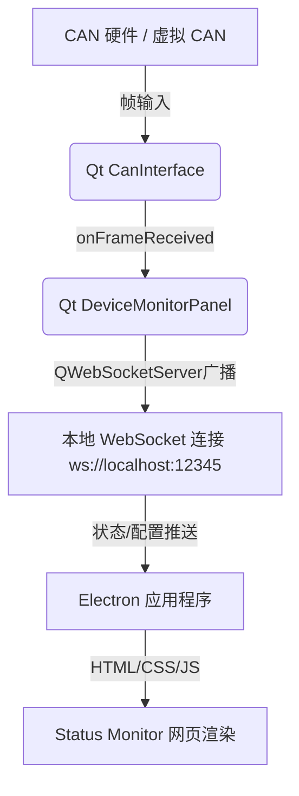

# 采用 Electron + WebSocket 独立进程方案实现设备状态监控网页版

我们将在现有的 Qt/C++ 应用中整合一个 WebSocket 服务器，并新建一个 Electron 独立桌面端，实现通过 HTML 页面实时监控设备状态。

## 架构方案设计



### 1. Qt/C++ 端（数据网关）
- 在 `STM32IDE.pro` 中引入 `QT += websockets` 模块。
- 在 `DeviceMonitorPanel` 中启动一个 `QWebSocketServer`（默认端口 `12345`）。
- 当有客户端（Electron）连接时，发送当前所有设备的配置列表及初始状态。
- 当接收到 CAN 帧并导致设备状态发生变更时，向所有连接的客户端广播状态更新 JSON 包：
  ```json
  {
    "type": "update",
    "deviceId": 1,
    "status": true,
    "prevStatus": false,
    "label": "1F大厅烟感01",
    "deviceType": "detector",
    "timestamp": "2026-07-18 20:54:12"
  }
  ```

### 2. Electron 端（网页监控版）
- 在工作区根目录下新建 `status-monitor-electron` 目录。
- 创建 `package.json` 引入 `electron` 及网页所需库。
- `index.html` 采用深色科技风设计，使用 HSL 配色和卡片网格布局展现各设备（烟温探测器/阀门）的 SVG 矢量图与状态。
- 引入 CSS 报警红光闪烁动画与渐变效果。
- `renderer.js` 自动连接本地 `ws://localhost:12345`。若断开则自动重连。

## Proposed Changes

---

### C++ 后端配置与源码修改

#### [MODIFY] [STM32IDE.pro](file:///m:/TOPFIRE/SmileCodeIDEUpdate/STM32IDE/STM32IDE.pro)
- 修改第 1 行，在 `QT` 变量中追加 `websockets`：
  ```diff
  -QT       += core gui serialport printsupport network
  +QT       += core gui serialport printsupport network websockets
  ```

#### [MODIFY] [devicemonitorpanel.h](file:///m:/TOPFIRE/SmileCodeIDEUpdate/STM32IDE/devicemonitorpanel.h)
- 引入 `#include <QWebSocketServer>` 和 `#include <QWebSocket>`。
- 在 `DeviceMonitorPanel` 类中声明 `QWebSocketServer *m_wsServer` 成员和连接的客户端列表 `QList<QWebSocket *> m_clients`。
- 声明 WebSocket 服务器相关槽函数：
  ```cpp
  void onNewConnection();
  void onClientDisconnected();
  ```
- 声明向客户端推送消息的私有方法：
  ```cpp
  void sendConfigToClient(QWebSocket *client);
  void broadcastMessage(const QJsonObject &json);
  ```

#### [MODIFY] [devicemonitorpanel.cpp](file:///m:/TOPFIRE/SmileCodeIDEUpdate/STM32IDE/devicemonitorpanel.cpp)
- 在构造函数中初始化并启动 `QWebSocketServer` 监听 `12345` 端口。
- 实现客户端连接与断开的信号连接。连接成功时，自动打包当前的配置与状态发回给客户端（使用 `QJsonDocument` / `QJsonObject`）。
- 在 `onFrameReceived` 槽函数中，当设备状态变动时，实时向客户端广播状态更新 JSON。

---

### Electron 监控客户端新建文件

#### [NEW] [package.json](file:///m:/TOPFIRE/SmileCodeIDEUpdate/status-monitor-electron/package.json)
- 配置主入口为 `main.js`，定义 `electron .` 启动命令。

#### [NEW] [main.js](file:///m:/TOPFIRE/SmileCodeIDEUpdate/status-monitor-electron/main.js)
- Electron 主进程，创建高宽合适的无边框或精美标题栏窗口，加载 `index.html`。

#### [NEW] [index.html](file:///m:/TOPFIRE/SmileCodeIDEUpdate/status-monitor-electron/index.html)
- 布局包括：
  - 顶栏：系统名称 "Status Monitor" 与 WebSocket 连接状态指示灯。
  - 主网格：卡片布局展现所有被监控的探测器和阀门，根据状态显示不同颜色的 SVG 图标（报警闪烁）。
  - 底栏：告警/事件滚动日志流。

#### [NEW] [style.css](file:///m:/TOPFIRE/SmileCodeIDEUpdate/status-monitor-electron/style.css)
- 纯手写精美 CSS 样式。包含深色科技背景、毛玻璃卡片（Glassmorphism）、呼吸灯效果、以及报警红光闪烁动画。

#### [NEW] [renderer.js](file:///m:/TOPFIRE/SmileCodeIDEUpdate/status-monitor-electron/renderer.js)
- 建立 WebSocket 客户端，实现断线重连（每3秒重试）。
- 解析 WebSocket 消息，动态渲染/更新网格中各个设备的卡片，并实时输出到滚动日志区。

## Verification Plan

### 编译验证
- 执行 `qmake` 和 `mingw32-make` 重新生成 Qt 应用程序并编译。

### Electron 客户端启动验证
- 在 `status-monitor-electron` 目录下执行 `npm install` 与 `npm start`，启动 Electron 窗口。

### 数据流验证
- 在 Qt 调试助手中打开虚拟 CAN 设备（VirtualUSBCAN）或实际 CAN 设备。
- 启动 Electron 窗口，观察连接状态变为“已连接”。
- 发送模拟帧（例如根据 `canprotocolconfigdialog` 配置的 ID 和 Byte/Bit 位置发送含有 `0x01` 的帧），确认 Electron 界面上的设备卡片同步转红并闪烁报警，且日志流中打印事件信息。
