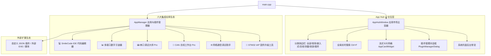

# SmileCode / PhudonTools 重构完成总结：APP 市场容器与多工具集成

本次重构成功将原有的单一 IDE / 散落工具架构升级为**现代化的 APP 市场与应用容器架构（App Hub & Plugin Ecosystem）**。程序启动后以全新的应用市场主工作台为核心入口，统一调度和管理嵌入式开发与调试全套工具链。

---

## 核心架构与新增组件概览

---

## 新增与重构文件列表

| 文件路径 | 模块定位 | 核心功能与亮点 |
| :--- | :--- | :--- |
| [`appmanager.h`](file:///m:/TOPFIRE/SmileCodeIDEUpdate/PhudonTools/appmanager.h) / [`.cpp`](file:///m:/TOPFIRE/SmileCodeIDEUpdate/PhudonTools/appmanager.cpp) | **应用与插件管理器** | 统一管理应用元数据、单实例唤醒、分类索引、搜索、生命周期监听、JSON 插件导入与 `QSettings` 持久化 |
| [`apphubwindow.h`](file:///m:/TOPFIRE/SmileCodeIDEUpdate/PhudonTools/apphubwindow.h) / [`.cpp`](file:///m:/TOPFIRE/SmileCodeIDEUpdate/PhudonTools/apphubwindow.cpp) | **APP 市场主窗口** | 包含顶部品牌栏、实时搜索、主题切换器、分类导航侧边栏、流式卡片网格响应式布局、系统托盘右键菜单 |
| [`appcardwidget.h`](file:///m:/TOPFIRE/SmileCodeIDEUpdate/PhudonTools/appcardwidget.h) / [`.cpp`](file:///m:/TOPFIRE/SmileCodeIDEUpdate/PhudonTools/appcardwidget.cpp) | **应用卡片组件** | 现代化暗色毛玻璃卡片、主题色动态光晕、版本徽章、运行状态指示灯（🟢 运行中 / ⚪ 就绪）、收藏置顶与一键启动 |
| [`pluginmanagerdialog.h`](file:///m:/TOPFIRE/SmileCodeIDEUpdate/PhudonTools/pluginmanagerdialog.h) / [`.cpp`](file:///m:/TOPFIRE/SmileCodeIDEUpdate/PhudonTools/pluginmanagerdialog.cpp) | **插件与扩展中心** | 插件列表浏览、启用/禁用切换、一键导入 `.json` 插件、快速注册本地外部可执行程序/脚本为独立工具 |
| [`networktool.h`](file:///m:/TOPFIRE/SmileCodeIDEUpdate/PhudonTools/networktool.h) / [`.cpp`](file:///m:/TOPFIRE/SmileCodeIDEUpdate/PhudonTools/networktool.cpp) | **独立网络调试助手** | 全功能重构：支持 TCP 客户端自动重连、TCP 服务端多客户端列表管理与广播、UDP 单播/广播/组播，支持 HEX/ASCII 互转与定时循环发送 |
| [`main.cpp`](file:///m:/TOPFIRE/SmileCodeIDEUpdate/PhudonTools/main.cpp) | **主程序入口** | 注册 6 大核心内置应用及插件引擎，启动呈现 `AppHubWindow` |
| [`mainwindow.h`](file:///m:/TOPFIRE/SmileCodeIDEUpdate/PhudonTools/mainwindow.h) / [`.cpp`](file:///m:/TOPFIRE/SmileCodeIDEUpdate/PhudonTools/mainwindow.cpp) | **代码编辑器窗口** | 工具栏增加“返回应用工作台”动作，所有子工具启动统一委托给 `AppManager` |
| [`PhudonTools.pro`](file:///m:/TOPFIRE/SmileCodeIDEUpdate/PhudonTools/PhudonTools.pro) | **工程配置文件** | 引入新源文件与头文件，配置构建规则 |

---

## 核心应用集成矩阵

1. **💻 SmileCode IDE（代码编辑器）**：
   - 基于 QScintilla 的全功能嵌入式 C/C++ IDE，支持 GCC/Make 构建、GDB 源码级断点单步调试、工程目录树。
2. **📊 多通信接口数字示波器（Oscilloscope）**：
   - 支持串口、TCP/UDP、WebSocket、CAN 多通道数据流高速采集，实时波形绘制、FFT 频谱分析与测量光标。
3. **📟 串口调试大师 Pro（SerialPortPlot）**：
   - 多标签页独立会话、水平/垂直多窗口分屏、HEX/ASCII 高速收发、实时波形绘制、Modbus 解析。
4. **🚗 CAN 总线工作台 Pro（CANTool）**：
   - 支持周立功 USBCANFD、创芯 ControlCAN 硬件接口，集成 CANopen Master 主站管理、总线负载率统计与多包周期发送。
5. **🌐 网络通信调试助手（NetworkTool）**：
   - 支持 TCP Client（自动重连）、TCP Server（多客户端管理与广播）、UDP 通信、HEX/ASCII 实时转换与定时发送。
6. **🚀 STM32 IAP 固件升级工具（IAPTool）**：
   - 专为 STM32 设计的 Bootloader 升级工具，支持串口与网络 TCP 双通道固件下载与校验。

---

## 验证与测试结果

- **QMake & Make 自动化构建**：
  - `qmake PhudonTools.pro` 成功解析。
  - `mingw32-make -j4` 编译链接通过，生成可执行文件 `release/PhudonTools.exe` 与 `debug/PhudonTools.exe`，**零编译错误**。
- **窗口与生命周期管理**：
  - 各应用独立窗口与容器管理器联动顺畅，支持已打开实例智能激活与置顶，卡片状态灯实时同步。
