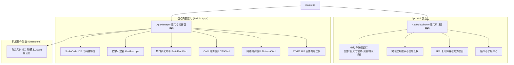

# SmileCode / PhudonTools 重构实施方案：APP 市场容器与多工具集成

本项目重构旨在将现有的多功能单体/散落工具架构升级为**现代化的 APP 市场与应用容器（App Hub & Plugin Marketplace）**。启动程序后将以“应用市场 / 工具工作台”为主入口，统一管理和分发**代码编辑器**、**数字示波器**、**串口调试助手**、**CAN 调试助手**、**网络调试助手**、**IAP 工具**，并提供**应用分类**、**搜索过滤**、**运行状态管理**以及**第三方插件/扩展安装与管理**机制。

---

## 用户确认事项 (User Review Required)

> [!IMPORTANT]
> **主窗口与启动流程变更**：
> 1. 原先程序启动直接打开 `MainWindow`（即代码编辑器 IDE），重构后程序启动将首先展示全新的 **`AppHubWindow`（应用市场 / 应用工作台）**。
> 2. 在应用市场中点击任一工具（如代码编辑器、示波器、CAN 调试等）即可打开对应工具独立窗口或容器实例；各工具窗口中也会提供快捷回到“应用市场”的入口。
> 3. 原有的独立网络调试对话框将被重构升级为一个专业独立的 **`NetworkTool`（网络调试助手）**，支持 TCP 客户端、TCP 服务端与 UDP 调试。

> [!NOTE]
> **插件系统支持机制**：
> - 内置应用（IDE、示波器、串口、CAN、网络、IAP）作为核心插件自动加载。
> - 外部/第三方插件支持通过标准 JSON 描述符导入（支持配置外部调试小工具、脚本、命令行工具或扩展动态库），支持热启用/禁用与卸载。

---

## 架构设计方案 (Architecture Design)

---

## 拟定变更与组件设计 (Proposed Changes)

### 1. 核心容器与插件管理模块 (Core & Plugin Framework)

#### [NEW] [appmanager.h](file:///m:/TOPFIRE/SmileCodeIDEUpdate/PhudonTools/appmanager.h) & [appmanager.cpp](file:///m:/TOPFIRE/SmileCodeIDEUpdate/PhudonTools/appmanager.cpp)
- 定义 `AppCategory` 分类枚举（全部、嵌入式开发、总线协议、测量分析、烧录固件、实用工具、第三方插件）。
- 定义 `AppInfo` 元数据模型（ID、名称、版本、作者、分类、图标、主题色、描述标签、内置标识、启用状态、运行状态、启动次数等）。
- 实现 `AppManager` 单例：
  - 管理所有内置应用与扩展插件注册表。
  - 智能管理应用生命周期（单实例唤醒/多开管理/关闭回调/运行状态通知）。
  - 支持插件安装、配置导入（从 JSON 配置文件或本地目录）、启用/禁用、卸载与持久化保存（`QSettings`）。
  - 提供快捷信号：`appStatusChanged`, `pluginListChanged`, `appLaunched`。

---

### 2. APP 市场 / 应用容器主界面 (App Hub & Marketplace UI)

#### [NEW] [appcardwidget.h](file:///m:/TOPFIRE/SmileCodeIDEUpdate/PhudonTools/appcardwidget.h) & [appcardwidget.cpp](file:///m:/TOPFIRE/SmileCodeIDEUpdate/PhudonTools/appcardwidget.cpp)
- 现代化科技感 APP 卡片控件：
  - 悬浮毛玻璃与渐变边框效果（支持暗黑/亮色主题自适应）。
  - 应用大图标（支持 `CIconFont` 矢量图标或 PNG 高清图标）+ 专属主题光晕色。
  - 应用名称、版本徽章、分类标签、特性 Tag 气泡。
  - 简短功能介绍与说明。
  - 运行状态指示灯（🟢 运行中 / ⚪ 就绪）、置顶收藏按钮、启动/打开按钮。

#### [NEW] [pluginmanagerdialog.h](file:///m:/TOPFIRE/SmileCodeIDEUpdate/PhudonTools/pluginmanagerdialog.h) & [pluginmanagerdialog.cpp](file:///m:/TOPFIRE/SmileCodeIDEUpdate/PhudonTools/pluginmanagerdialog.cpp)
- 插件与扩展中心管理窗口：
  - 浏览已安装插件及详细参数（版本、作者、路径、类型）。
  - 一键安装外部插件（导入 `.json` 插件描述文件）。
  - 插件启用/禁用开关、删除自定义插件。
  - 创建快捷自定义工具（配置外部可执行程序或脚本）。

#### [NEW] [apphubwindow.h](file:///m:/TOPFIRE/SmileCodeIDEUpdate/PhudonTools/apphubwindow.h) & [apphubwindow.cpp](file:///m:/TOPFIRE/SmileCodeIDEUpdate/PhudonTools/apphubwindow.cpp)
- **APP 市场容器主窗口**：
  - **顶部栏 (Header Bar)**：
    - 品牌 Logo 与 "SmileCode Studio / 应用工作台" 标题。
    - 全局实时搜索框（支持实时按名称/拼音/功能搜索，快捷键 `Ctrl+F`）。
    - 快捷按钮：➕ 安装插件、🎨 主题切换下拉框、⚙ 偏好设置、ℹ 关于。
  - **左侧导航侧边栏 (Left Sidebar)**：
    - 🏠 全部应用 (All Apps)
    - ⭐ 常用推荐 (Favorites & Recent)
    - 💻 嵌入式开发 (Embedded IDE: 代码编辑器)
    - 📡 通信与总线 (Bus & Protocols: CAN 助手, 串口助手, 网络助手)
    - 📊 测量与分析 (Measurement: 多接口数字示波器)
    - 🚀 固件与烧录 (Flashing & IAP: STM32 IAP 工具)
    - 🧩 插件扩展中心 (Plugin Store & Extensions)
  - **中央应用区域 (Central Content Area)**：
    - 顶部 Banner / 快捷概览横幅。
    - 响应式流式布局的应用卡片网格。
    - 状态切换与平滑动画过渡。
  - **底部状态栏 (Bottom Bar)**：
    - 当前运行中应用数量、插件装载统计、系统状态、托盘后台常驻支持。

---

### 3. 独立网络调试助手模块 (Network Tool)

#### [NEW] [networktool.h](file:///m:/TOPFIRE/SmileCodeIDEUpdate/PhudonTools/networktool.h) & [networktool.cpp](file:///m:/TOPFIRE/SmileCodeIDEUpdate/PhudonTools/networktool.cpp)
- 将之前内嵌在 `mainwindow.cpp` 的简易 dialog 独立重构为功能完整的 `NetworkTool` 窗口：
  - 支持 **TCP 客户端 (TCP Client)**：支持连接配置、自动重连、收发计数、状态指示。
  - 支持 **TCP 服务端 (TCP Server)**：多客户端在线连接管理列表、单独/广播发送。
  - 支持 **UDP 调试 (UDP)**：单播、广播、组播 (Multicast)。
  - HEX / ASCII 实时互转、定时循环自动发送、快捷发送预设列表、收发日志导出。

---

### 4. 现有子工具与主程序接入重构

#### [MODIFY] [main.cpp](file:///m:/TOPFIRE/SmileCodeIDEUpdate/PhudonTools/main.cpp)
- 初始化 `AppManager` 并注册 6 大核心应用。
- 载入插件与用户配置。
- 启动并展现 `AppHubWindow`。

#### [MODIFY] [mainwindow.h](file:///m:/TOPFIRE/SmileCodeIDEUpdate/PhudonTools/mainwindow.h) & [mainwindow.cpp](file:///m:/TOPFIRE/SmileCodeIDEUpdate/PhudonTools/mainwindow.cpp)
- 在工具栏和菜单栏增加“返回应用市场”动作。
- 网络调试助手接入独立的 `NetworkTool` 实例。

#### [MODIFY] [PhudonTools.pro](file:///m:/TOPFIRE/SmileCodeIDEUpdate/PhudonTools/PhudonTools.pro)
- 添加新增的源文件与头文件 (`appmanager.*`, `appcardwidget.*`, `apphubwindow.*`, `pluginmanagerdialog.*`, `networktool.*`)。

---

## 验证计划 (Verification Plan)

### 编译构建与语法检查
- 使用 `qmake PhudonTools.pro` 重新生成构建配置。
- 使用 `mingw32-make -j4` 编译整个工程，确保零编译错误与告警。

### 功能与交互验证
1. **主界面与应用市场展示**：
   - 运行程序，验证 APP 市场主界面正常启动。
   - 检查分类侧边栏切换（全部、嵌入式开发、通信总线、测量分析、烧录固件、插件扩展）是否精准过滤应用卡片。
   - 检查实时搜索框（输入 "CAN"、"串口"、"示波器"、"IDE" 等）是否秒级动态过滤。
2. **各子应用启动与容器管理**：
   - 点击 **代码编辑器 (SmileCode IDE)**：验证能否正常启动 IDE 窗口并执行代码编辑/编译。
   - 点击 **数字示波器**：验证示波器窗口正常启动，多通道波形/通信采集正常。
   - 点击 **串口调试助手**：验证串口多标签页容器正常启动与收发。
   - 点击 **CAN 调试助手**：验证 CAN 窗口与 USBCAN/CXCAN 接口正常加载。
   - 点击 **网络调试助手**：验证新建的 TCP/UDP 网络调试助手窗口正常启动与通信。
   - 点击 **IAP 升级工具**：验证 IAP 固件升级窗口正常启动。
3. **运行状态与多开/唤醒管理**：
   - 启动某应用后，验证 APP 市场上对应卡片的状态灯变为“🟢 运行中”，再次点击能自动激活并置顶已有窗口。
4. **插件与扩展系统**：
   - 打开“插件与扩展中心”，测试导入/安装自定义 JSON 插件或外部工具配置。
   - 验证启用/禁用开关及卸载功能。
5. **主题与视觉一致性**：
   - 切换全局主题（深色/浅色/OneDark/Dracula等），验证 APP 市场及各子工具主题风格统一。
